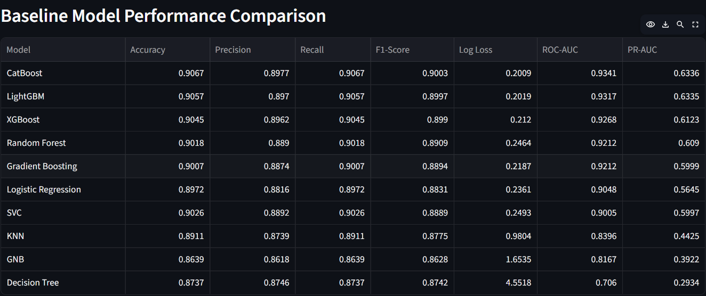

# 🏦 Bank Marketing Campaign Response Prediction

[](https://www.python.org/)
[](https://scikit-learn.org/)
[](https://catboost.ai/)
[](https://scikit-learn.org/)
[](https://streamlit.io/)

> An end-to-end machine learning classification application that predicts whether a customer will respond positively to a targeted bank marketing campaign.

🚀 **Live Demo:**
https://akhlaque03-bank-marketing-campaign-response-prediction.streamlit.app/

---

## 🎯 What This Project Does

This project uses customer demographic, financial, campaign, and previous-contact information to predict whether a customer will respond positively to a bank marketing campaign.

The final application uses a **hyperparameter-tuned CatBoost Classifier** and provides both the predicted class and response probabilities.

### Key Highlights

* 🤖 CatBoost-based customer response prediction
* 🎯 Binary classification: **Yes / No**
* 📊 Response probabilities for both outcomes
* 📈 ROC-AUC and PR-AUC based evaluation
* 🔄 Baseline vs. tuned model comparison
* 🔍 Feature importance analysis
* 🌐 Interactive Streamlit application
* 🚀 Public cloud deployment

---

## 📌 Project Overview

Bank marketing campaigns generate large volumes of customer interactions, but customers do not have the same likelihood of responding positively.

This project develops an **end-to-end binary classification solution** to identify customers who are more likely to respond positively to a targeted marketing campaign.

The complete workflow covers:

* Data preprocessing
* Exploratory Data Analysis (EDA)
* Feature engineering
* Categorical encoding
* Multiple classification models
* Baseline model comparison
* Hyperparameter tuning
* Original vs. tuned model evaluation
* Feature importance analysis
* Final model selection
* Interactive prediction
* Streamlit deployment

The deployed application allows users to enter customer and campaign information and receive:

* **Predicted Response:** `Yes` / `No`
* **No Response Probability**
* **Yes Response Probability**
* **Final Model Used**

---

## 💼 Business Value

The primary business value of this solution is **customer targeting**.

Instead of treating every customer equally, marketing teams can use model-generated probabilities to identify customers with a higher likelihood of responding positively.

This can support:

* More targeted campaign outreach
* Better prioritization of customer contacts
* Reduced unnecessary outreach
* More data-driven campaign decisions
* Improved understanding of customer response patterns

> **Note:** The model provides predictive insights and should be evaluated alongside business rules, campaign costs, and operational constraints before being used for real-world targeting decisions.

---

## 🎯 Project Objectives

The main objective is to build a reliable classification system for predicting customer response to bank marketing campaigns.

### Key Objectives

* Predict customer response to a targeted marketing campaign.
* Analyze customer demographic and financial characteristics.
* Analyze campaign interaction and previous campaign information.
* Compare multiple classification algorithms.
* Identify the strongest baseline model.
* Apply hyperparameter tuning to selected models.
* Compare original and tuned model performance.
* Analyze feature importance.
* Build an interactive prediction application.
* Provide prediction probabilities for additional model insight.
* Deploy the final model for public access.

---

## 📂 Dataset Information

The project uses the **Bank Marketing dataset**, containing customer demographic information, financial attributes, campaign details, and previous campaign outcomes.

The dataset is used to learn patterns associated with customer responses and build a binary classification model.

### Input Feature Categories

| Category                      | Features                                      |
| ----------------------------- | --------------------------------------------- |
| **Customer Profile**          | Age, Job, Marital Status, Education           |
| **Financial Information**     | Balance, Default, Housing Loan, Personal Loan |
| **Campaign Information**      | Day, Month, Contact, Campaign, Duration       |
| **Previous Campaign History** | Previous Campaign Outcome                     |

### Features Used by the Model

* `age`
* `balance`
* `day`
* `duration`
* `campaign`
* `job`
* `marital`
* `education`
* `default`
* `housing`
* `loan`
* `contact`
* `month`
* `poutcome`

### Target Variable

**Customer Response**

* `Yes` → Customer responded positively
* `No` → Customer did not respond

The target is treated as a **binary classification problem**.

---

## ⚠️ Feature Availability Consideration

The `duration` feature was identified as the most influential feature in the trained model.

However, **call duration is observed during or after a customer interaction**. Therefore, it should not automatically be interpreted as a feature available before a campaign contact begins.

For a real-world **pre-campaign targeting system**, the model should be retrained without post-contact variables such as `duration`.

This distinction is important when translating model performance into a real production targeting strategy.

---

## 🛠️ Data Preprocessing & Feature Engineering

Before model training, the dataset was prepared to ensure that the input variables were suitable for machine learning.

### Preprocessing Steps

* Checked missing values and inconsistent entries.
* Reviewed duplicate records and data quality.
* Analyzed numerical and categorical variables.
* Examined feature distributions.
* Investigated relationships between features and the target.
* Prepared categorical variables for machine learning.

### Categorical Encoding

Categorical features were converted into numerical representations using **One-Hot Encoding**.

Examples of generated features include:

* `job_blue-collar`
* `job_management`
* `marital_married`
* `education_tertiary`
* `housing_yes`
* `contact_unknown`
* `month_may`
* `poutcome_success`

### Feature Alignment

The deployed application uses the same feature structure expected by the trained model.

A saved feature-column configuration ensures that transformed user inputs are aligned with the feature structure used during model training.

This helps maintain consistency between:

**Training → Transformation → Production Inference**

---

## 🔍 Exploratory Data Analysis

Exploratory Data Analysis was performed to understand customer characteristics, campaign behavior, feature distributions, and relationships within the dataset.

### Analysis Performed

* **Univariate Analysis** — examined individual numerical and categorical feature distributions.
* **Bivariate Analysis** — analyzed relationships between important features and customer response.
* **Multivariate Analysis** — investigated interactions among multiple variables.
* **Categorical Analysis** — evaluated response patterns across job, education, contact, housing, loan, month, and previous campaign outcome.
* **Numerical Analysis** — analyzed age, balance, duration, day, and campaign-related variables.
* **Correlation Analysis** — investigated relationships among numerical variables.
* **Feature Importance Analysis** — identified the strongest predictive signals in the final model.

### Key Insight

The final model's feature importance analysis identified:

1. `duration`
2. `contact_unknown`
3. `day`
4. `poutcome_success`
5. `month_may`

among the most influential features.

The analysis provided insight into the predictive patterns captured by the model.

> **Important:** Feature importance indicates how strongly a feature contributes to model predictions; it does not establish a causal relationship with customer response.

---

## 🤖 Machine Learning Models Evaluated

Multiple classification algorithms were trained and evaluated to establish baseline performance and identify suitable candidates for further optimization.

### Baseline Models

* Logistic Regression
* K-Nearest Neighbors (KNN)
* Support Vector Classifier (SVC)
* Gaussian Naive Bayes (GNB)
* Decision Tree Classifier
* Random Forest Classifier
* Gradient Boosting Classifier
* XGBoost Classifier
* LightGBM Classifier
* CatBoost Classifier

---

## 📊 Evaluation Metrics

The models were evaluated using multiple classification metrics:

| Metric        | Purpose                                                                   |
| ------------- | ------------------------------------------------------------------------- |
| **Accuracy**  | Overall proportion of correct predictions                                 |
| **Precision** | Proportion of predicted positive responses that were actually positive    |
| **Recall**    | Proportion of actual positive responses correctly identified              |
| **F1-Score**  | Harmonic mean of precision and recall                                     |
| **Log Loss**  | Evaluates the quality of predicted probabilities                          |
| **ROC-AUC**   | Measures class-separation ability across decision thresholds              |
| **PR-AUC**    | Evaluates precision-recall performance, especially for the positive class |

**ROC-AUC** was used as the primary ranking metric for model selection.

---

## 🏁 Baseline Model Comparison

All baseline models were evaluated using the same evaluation framework.

**ROC-AUC** was selected as the primary ranking metric because it evaluates how effectively a classifier separates positive and negative responses across different decision thresholds.

### Baseline Performance

| Model               | Accuracy | Precision | Recall | F1-Score | Log Loss |    ROC-AUC | PR-AUC |
| ------------------- | -------: | --------: | -----: | -------: | -------: | ---------: | -----: |
| **CatBoost**        |   0.9067 |    0.8977 | 0.9067 |   0.9003 |   0.2009 | **0.9341** | 0.6336 |
| LightGBM            |   0.9057 |    0.8970 | 0.9057 |   0.8997 |   0.2019 |     0.9317 | 0.6335 |
| XGBoost             |   0.9045 |    0.8962 | 0.9045 |   0.8990 |   0.2120 |     0.9268 | 0.6123 |
| Random Forest       |   0.9018 |    0.8890 | 0.9018 |   0.8909 |   0.2464 |     0.9212 | 0.6090 |
| Gradient Boosting   |   0.9007 |    0.8874 | 0.9007 |   0.8894 |   0.2187 |     0.9212 | 0.5999 |
| Logistic Regression |   0.8972 |    0.8816 | 0.8972 |   0.8831 |   0.2361 |     0.9048 | 0.5645 |
| SVC                 |   0.9026 |    0.8892 | 0.9026 |   0.8889 |   0.2493 |     0.9005 | 0.5997 |
| KNN                 |   0.8911 |    0.8739 | 0.8911 |   0.8775 |   0.9804 |     0.8396 | 0.4425 |
| GNB                 |   0.8639 |    0.8618 | 0.8639 |   0.8628 |   1.6535 |     0.8167 | 0.3922 |
| Decision Tree       |   0.8737 |    0.8746 | 0.8737 |   0.8742 |   4.5518 |     0.7060 | 0.2934 |

### Baseline Result

**CatBoost achieved the highest baseline ROC-AUC of 0.9341**, making it the strongest baseline model according to the project's primary evaluation criterion.

The baseline comparison was then used to select boosting models for hyperparameter optimization.

---

## ⚙️ Hyperparameter Tuning

After baseline evaluation, hyperparameter tuning was performed on selected boosting algorithms to search for configurations that could improve classification performance.

### Models Tuned

* **CatBoost Classifier**
* **XGBoost Classifier**
* **LightGBM Classifier**

The tuning process searched for improved parameter configurations while maintaining a consistent evaluation framework.

### Tuning Objective

The tuned models were compared with their corresponding original versions using:

* Accuracy
* Precision
* Recall
* F1-Score
* Log Loss
* ROC-AUC
* PR-AUC

The final selection continued to use **ROC-AUC as the primary ranking metric**.

---

## 🔄 Original vs. Tuned Model Comparison

The tuned models were compared with their original versions to evaluate the impact of hyperparameter optimization.

### Comparison Results

| Model              | Accuracy |  Precision | Recall |   F1-Score |   Log Loss |    ROC-AUC |     PR-AUC |
| ------------------ | -------: | ---------: | -----: | ---------: | ---------: | ---------: | ---------: |
| **CatBoost Tuned** |   0.8610 | **0.9188** | 0.8610 |     0.8782 |     0.3173 | **0.9350** | **0.6397** |
| CatBoost Original  |   0.9067 |     0.8977 | 0.9067 | **0.9003** | **0.2009** |     0.9341 |     0.6336 |
| XGBoost Tuned      |   0.8660 |     0.9174 | 0.8660 |     0.8817 |     0.2984 |     0.9338 |     0.6385 |
| LightGBM Tuned     |   0.8527 |     0.9167 | 0.8527 |     0.8717 |     0.3259 |     0.9322 |     0.6306 |
| LightGBM Original  |   0.9057 |     0.8970 | 0.9057 |     0.8997 |     0.2019 |     0.9317 |     0.6335 |
| XGBoost Original   |   0.9045 |     0.8962 | 0.9045 |     0.8990 |     0.2120 |     0.9268 |     0.6123 |

### Key Finding

**CatBoost Tuned achieved the highest ROC-AUC (0.9350) and PR-AUC (0.6397)** among the compared models.

However, hyperparameter tuning did **not improve every metric**.

Compared with CatBoost Original:

* Accuracy decreased from **0.9067 → 0.8610**
* Recall decreased from **0.9067 → 0.8610**
* F1-Score decreased from **0.9003 → 0.8782**
* Precision increased from **0.8977 → 0.9188**
* ROC-AUC increased from **0.9341 → 0.9350**
* PR-AUC increased from **0.6336 → 0.6397**
* Log Loss increased from **0.2009 → 0.3173**

Therefore, the tuned model was selected based on the project's **primary ranking criterion, ROC-AUC**, rather than accuracy alone.

---

## 🏆 Final Model Selection

Based on the comparative evaluation, **CatBoost Tuned** was selected as the final production model.

### CatBoost Classifier — Hyperparameter Tuned

| Metric    |      Score |
| --------- | ---------: |
| Accuracy  |     0.8610 |
| Precision | **0.9188** |
| Recall    |     0.8610 |
| F1-Score  |     0.8782 |
| Log Loss  |     0.3173 |
| ROC-AUC   | **0.9350** |
| PR-AUC    | **0.6397** |

### Why CatBoost Tuned?

CatBoost Tuned was selected because it achieved:

* 🥇 **Highest ROC-AUC:** 0.9350
* 🥇 **Highest Precision:** 0.9188
* 🥇 **Highest PR-AUC:** 0.6397

The model therefore provided the strongest performance according to the project's selected ranking criteria.

The trained model was serialized and integrated into the Streamlit application for production inference.

---

## 🔍 Feature Importance Analysis

Feature importance analysis was performed using the final **CatBoost Tuned** model to understand which variables contributed most strongly to its predictions.

### Top 10 Important Features

| Rank | Feature            | Importance |
| ---: | ------------------ | ---------: |
|    1 | `duration`         |  30.014453 |
|    2 | `contact_unknown`  |   9.764939 |
|    3 | `day`              |   8.833413 |
|    4 | `poutcome_success` |   5.591781 |
|    5 | `month_may`        |   4.304850 |
|    6 | `housing_yes`      |   4.004956 |
|    7 | `age`              |   3.964837 |
|    8 | `balance`          |   3.754881 |
|    9 | `poutcome_unknown` |   3.398896 |
|   10 | `month_jul`        |   3.186803 |

### Key Insight

The analysis shows that **`duration`** has the largest feature importance by a significant margin.

Other influential variables include:

* Contact type
* Day of contact
* Previous campaign outcome
* Campaign month
* Housing status
* Age
* Account balance

> **Note:** Feature importance describes the contribution of variables to model predictions. It does not establish that a feature causes a customer to respond.

---

## 💻 Streamlit Web Application

The trained **CatBoost Tuned** model is integrated into an interactive Streamlit application that allows users to generate customer response predictions without writing code.

### 👤 Customer & Campaign Inputs

Users can provide:

* Age
* Account Balance
* Day
* Call Duration
* Campaign Contacts
* Job
* Marital Status
* Education
* Default Status
* Housing Loan
* Personal Loan
* Contact Type
* Campaign Month
* Previous Campaign Outcome

### 🎯 Prediction Output

After selecting the customer and campaign information, the application provides:

* **Customer Response:** `Yes` / `No`
* **No Response Probability**
* **Yes Response Probability**
* **Model Used:** CatBoost Tuned

The probability output provides additional information beyond the binary prediction and helps users understand the model's estimated likelihood for each outcome.

---

## 📸 Application Screenshots

The following screenshots showcase the deployed application's user interface, prediction workflow, model evaluation, and feature importance analysis.

---

### 🏠 Application Home & Prediction Interface

The main application provides an interactive interface where users can enter customer and campaign information to generate a response prediction.


---

### ✅ Positive Response Prediction

Example of a customer predicted to respond positively to the marketing campaign, along with the corresponding response probabilities.


---

### ❌ Negative Response Prediction

Example of a customer predicted not to respond to the marketing campaign, along with the corresponding response probabilities.


---

### 📊 Baseline Model Performance

Comparison of baseline classification models across multiple evaluation metrics.


#### Baseline ROC-AUC Comparison

Visual ranking of baseline classification models based on ROC-AUC, the primary metric used for model selection.



---

### 🔄 Original vs. Tuned Models

Comparison of the original and hyperparameter-tuned boosting models across multiple classification metrics.


#### Original vs. Tuned ROC-AUC Comparison

Visual comparison of original and tuned models based on ROC-AUC.


---

### 🔍 Feature Importance Analysis

Top 10 features contributing to the predictions of the final CatBoost Tuned model.


---

## 📁 Project Structure

```text
Bank-Marketing-Campaign-Response-Prediction/
│
├── app.py
├── requirements.txt
├── final_model_cb_tuned.pkl
├── Feature_columns.pkl
├── README.md
│
└── screenshots/
    ├── 01_home.png
    ├── 02_prediction_yes.png
    ├── 03_prediction_no.png
    ├── 04_baseline_model_table.png
    ├── 05_baseline_model_graph.png
    ├── 06_original_vs_tuned_table.png
    ├── 07_original_vs_tuned_graph.png
    └── 08_feature_importance_graph.png
```

### File & Folder Description

| File / Folder              | Description                                                       |
| -------------------------- | ----------------------------------------------------------------- |
| `app.py`                   | Streamlit application containing the prediction workflow          |
| `final_model_cb_tuned.pkl` | Serialized CatBoost Tuned classification model                    |
| `Feature_columns.pkl`      | Saved feature-column configuration used during prediction         |
| `requirements.txt`         | Python dependencies required to run the application               |
| `screenshots/`             | Application, model evaluation, and feature importance screenshots |
| `README.md`                | Project documentation                                             |

---

## 🛠️ Technologies Used

### Programming Language

* **Python**

### Data Processing & Analysis

* **Pandas**
* **NumPy**

### Data Visualization

* **Matplotlib**

### Machine Learning

* **Scikit-learn**
* **CatBoost**
* **XGBoost**
* **LightGBM**

### Model Evaluation

* Accuracy
* Precision
* Recall
* F1-Score
* Log Loss
* ROC-AUC
* PR-AUC

### Deployment & Development

* **Streamlit**
* **Joblib**
* **Jupyter Notebook**
* **GitHub**
* **Streamlit Community Cloud**

---

## 🚀 Installation & Local Setup

Follow the steps below to run the application locally.

### 1. Clone the Repository

```bash
git clone https://github.com/Akhlaque03/Bank-Marketing-Campaign-Response-Prediction.git
```

### 2. Navigate to the Project Directory

```bash
cd Bank-Marketing-Campaign-Response-Prediction
```

### 3. Create a Virtual Environment

```bash
python -m venv venv
```

**Windows:**

```bash
venv\Scripts\activate
```

**macOS / Linux:**

```bash
source venv/bin/activate
```

### 4. Install Dependencies

```bash
pip install -r requirements.txt
```

### 5. Run the Streamlit Application

```bash
streamlit run app.py
```

The application will open in your browser at the local Streamlit address.

---

## 🚀 Deployment

The machine learning application is deployed using **Streamlit Community Cloud**, providing a publicly accessible interface for customer response predictions.

### Deployment Workflow

```text
Model Training
      ↓
CatBoost Tuned Model
      ↓
Model Serialization
      ↓
GitHub Repository
      ↓
Streamlit Community Cloud
      ↓
Live Prediction Application
```

### 🌐 Live Application

**Try the deployed application:**

https://akhlaque03-bank-marketing-campaign-response-prediction.streamlit.app/

The deployed application loads the saved model and feature configuration, accepts customer information through the Streamlit interface, and generates the predicted response along with response probabilities.

---

## 🔮 Future Enhancements

The current application provides a complete machine learning prediction workflow, while several improvements could further enhance its production readiness and business value.

Potential future enhancements include:

* 📊 **Interactive Analytics Dashboard** — add campaign-level analytics and customer response trends.
* 🎯 **Customer Segmentation** — group customers based on behavioral and financial characteristics.
* 🔍 **Explainable Predictions** — integrate SHAP-based explanations to show why individual predictions are generated.
* 📈 **Model Monitoring** — track prediction performance and detect model/data drift after deployment.
* 🔄 **Automated Model Retraining** — periodically retrain the model using newly collected campaign data.
* 🌐 **Production API Layer** — expose the prediction model through a dedicated REST API.
* ⚙️ **CI/CD Pipeline** — automate testing, deployment, and application updates.
* 🧪 **Pre-Campaign Model Version** — develop a separate model excluding post-contact variables such as `duration` for realistic pre-call targeting.

---

## 👨‍💻 Author

### Akhlaque Alam

**Aspiring Data Scientist | Python | SQL | Machine Learning | Data Analysis**

I am passionate about building practical machine learning solutions, analyzing real-world data, and developing deployable data-driven applications.

### Core Skills

* Python
* SQL
* Machine Learning
* Data Analysis & EDA
* Data Visualization
* Streamlit Deployment

### 🔗 Connect With Me

* **GitHub:** [Akhlaque03](https://github.com/Akhlaque03)
* **LinkedIn:** [Akhlaque Alam](https://www.linkedin.com/in/akhlaque-alam-788a53410/)

I am open to **Data Science, Machine Learning, and Data Analyst internship opportunities**.

---

⭐ If you found this project useful, consider giving the repository a **Star**.
