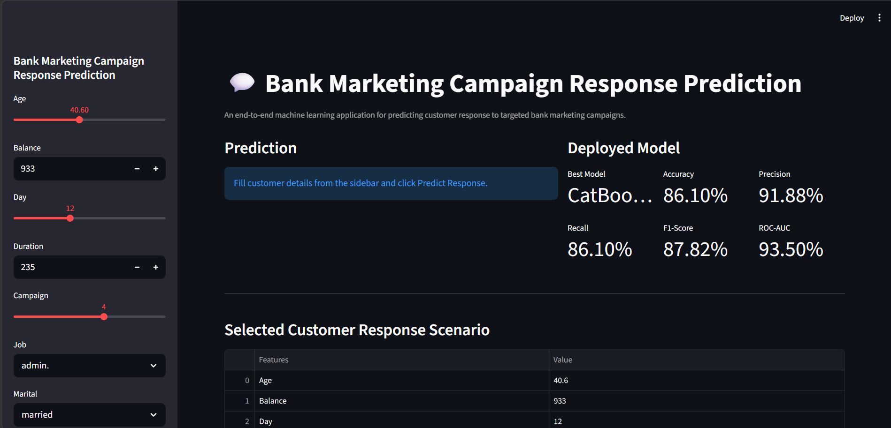
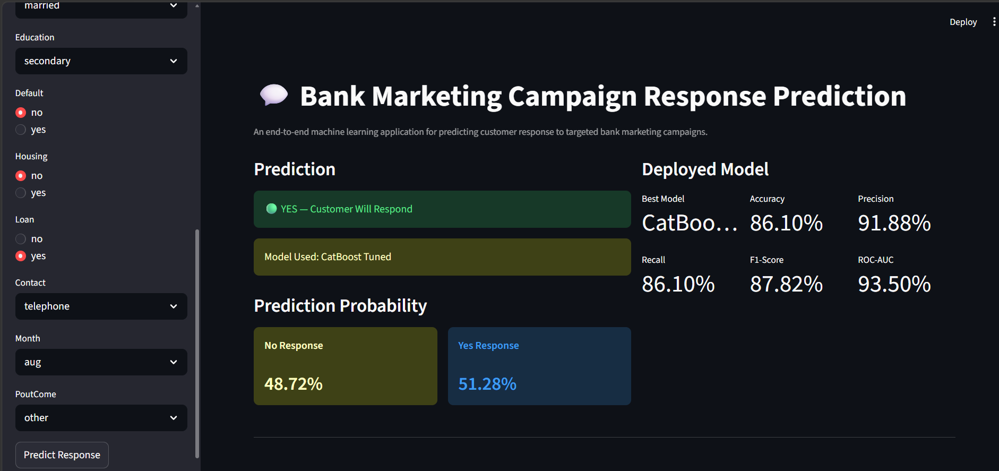
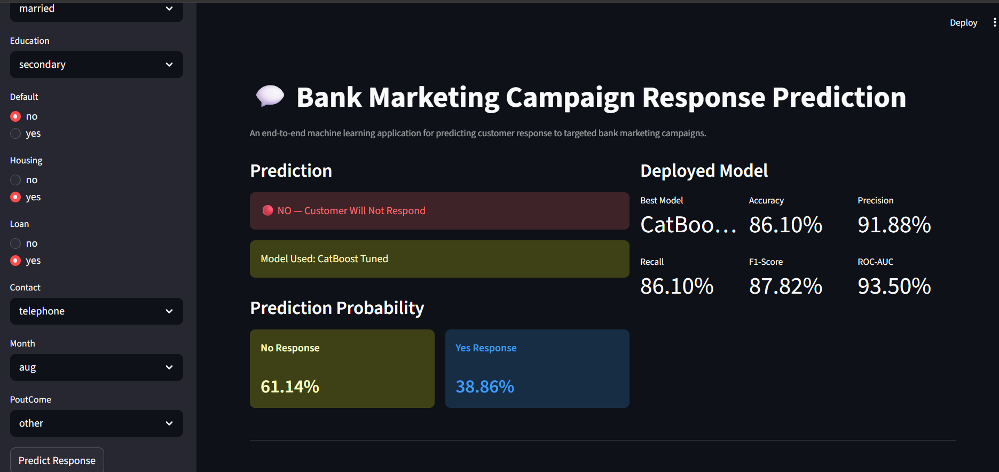
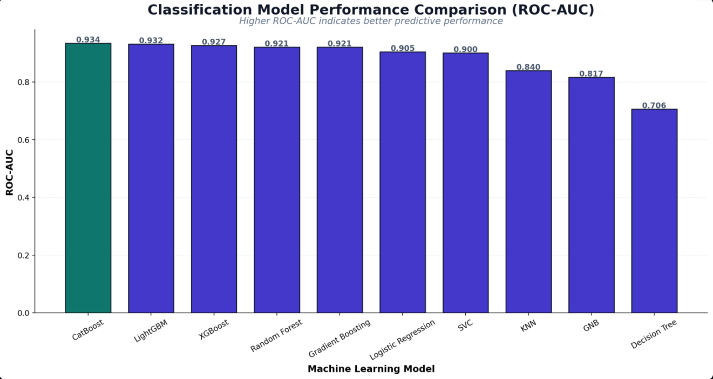
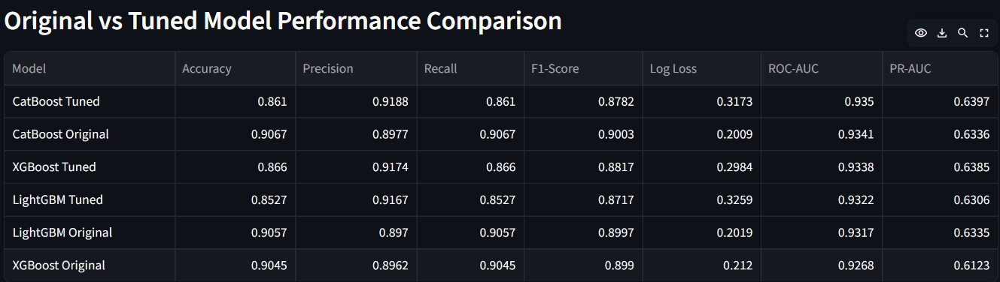
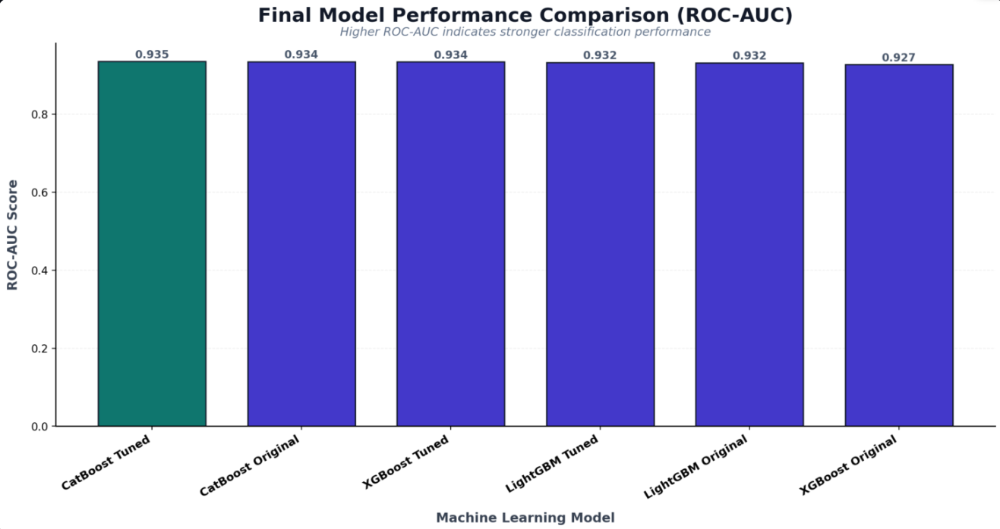
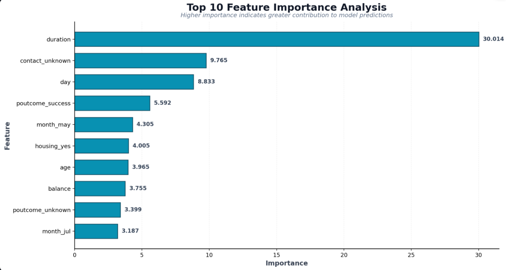

# 🏦 Bank Marketing Campaign Response Prediction


> An end-to-end machine learning classification application that predicts whether a customer will respond positively to a targeted bank marketing campaign.

🚀 **Live Demo:** https://akhlaque03-bank-marketing-campaign-response-prediction.streamlit.app/

### 🎯 What This Project Does

This application uses customer demographic, financial, campaign, and previous-contact information to predict **customer response (`Yes` / `No`)** and provides the **response probability for both outcomes** using a tuned CatBoost classification model.

**Key highlights:**

*  CatBoost-based customer response prediction
*  Probability scores for both **Yes Response** and **No Response**
*  ROC-AUC and PR-AUC based model evaluation
*  Original vs. hyperparameter-tuned model comparison
*  Feature importance analysis
*  Interactive Streamlit deployment


## 📌 Project Overview

Bank marketing campaigns generate large volumes of customer interactions, but not every customer is equally likely to respond positively. Identifying customers with a higher probability of responding can help marketing teams make campaigns more targeted and efficient.

This project develops an **end-to-end binary classification solution** to predict whether a customer will respond positively to a bank marketing campaign.

The complete machine learning workflow covers:

* Data preprocessing and preparation
* Exploratory Data Analysis (EDA)
* Feature engineering and categorical encoding
* Training and evaluation of multiple classification algorithms
* Baseline model comparison
* Hyperparameter tuning
* Original vs. tuned model evaluation
* Feature importance analysis
* Final model selection
* Interactive prediction with response probabilities
* Streamlit deployment

The final application allows users to enter customer and campaign information and receive:

* **Predicted customer response — Yes / No**
* **Probability of No Response**
* **Probability of Yes Response**
* **Final model used for prediction**

The selected **CatBoost Tuned** model is deployed as an interactive Streamlit application for real-time predictions.


## 🎯 Project Objectives

The primary objective of this project is to build a reliable machine learning solution that can identify customers who are more likely to respond positively to bank marketing campaigns.

### Key Objectives

* Predict customer response to a targeted bank marketing campaign.
* Analyze customer demographics, financial characteristics, and campaign interaction data.
* Compare multiple classification algorithms using relevant evaluation metrics.
* Identify the strongest baseline model based on classification performance.
* Apply hyperparameter tuning to selected machine learning models.
* Compare original and tuned models to evaluate performance improvements.
* Analyze feature importance to understand which factors contribute most to predictions.
* Develop an interactive Streamlit application for real-time customer response prediction.
* Provide prediction probabilities to give users additional insight into model confidence.
* Deploy the final machine learning application for public access.


##  Dataset Information

The project uses the **Bank Marketing dataset**, which contains customer demographic information, financial attributes, campaign details, and outcomes from previous marketing interactions.

The dataset is used to understand customer behavior and build a classification model that predicts whether a customer will respond positively to a marketing campaign.

### Input Features

| Category                      | Features                                      |
| ----------------------------- | --------------------------------------------- |
| **Customer Profile**          | Age, Job, Marital Status, Education           |
| **Financial Information**     | Balance, Default, Housing Loan, Personal Loan |
| **Campaign Information**      | Day, Month, Contact, Campaign                 |
| **Previous Campaign History** | Previous Campaign Outcome                     |

### Features Used by the Model

* `age`
* `balance`
* `day`
* `duration`
* `campaign`
* `job`
* `marital`
* `education`
* `default`
* `housing`
* `loan`
* `contact`
* `month`
* `poutcome`

### Target Variable

**Customer Response**

* `Yes` → Customer responded positively
* `No` → Customer did not respond

The target variable is treated as a **binary classification problem**.


## 🛠️ Data Preprocessing & Feature Engineering

Before training the classification models, the dataset was prepared to ensure that the input features were in a suitable format for machine learning.

### Preprocessing Steps

* Checked the dataset for missing values and inconsistent entries.
* Reviewed duplicate records and data quality.
* Analyzed numerical and categorical features.
* Evaluated feature distributions and relationships with the target variable.
* Prepared categorical variables for machine learning.

### Categorical Encoding

Categorical features were converted into numerical representations using **One-Hot Encoding**.

This created model-ready features such as:

* `job_blue-collar`
* `job_management`
* `marital_married`
* `education_tertiary`
* `housing_yes`
* `contact_unknown`
* `month_may`
* `poutcome_success`

### Feature Alignment

The final prediction application uses the same feature structure expected by the trained model.

The stored feature-column configuration ensures that user inputs are transformed into the correct model-ready format before generating predictions.

This helps maintain consistency between **model training** and **production inference**.


##  Exploratory Data Analysis

Exploratory Data Analysis was performed to understand customer characteristics, campaign behavior, feature distributions, and relationships within the dataset before model development.

### Analysis Performed

* **Univariate Analysis** — examined distributions of individual numerical and categorical features.
* **Bivariate Analysis** — analyzed relationships between important features and customer response.
* **Multivariate Analysis** — studied interactions among multiple variables.
* **Categorical Analysis** — evaluated customer response across job, education, contact, housing, loan, month, and previous campaign outcome.
* **Numerical Analysis** — examined variables such as age, balance, duration, day, and campaign.
* **Correlation Analysis** — investigated relationships among numerical features.
* **Feature Importance Analysis** — identified the features contributing most strongly to the final model predictions.

### Key Insight

The feature importance analysis showed that **`duration`** was the most influential feature in the final model, followed by **`contact_unknown`**, **`day`**, and **`poutcome_success`**.

The analysis helped guide the modelling process and provided a better understanding of the factors associated with customer campaign response.


## 🤖 Machine Learning Models Evaluated

Multiple classification algorithms were trained and evaluated to establish baseline performance and identify the most suitable model for predicting customer response.

### Baseline Models

* Logistic Regression
* K-Nearest Neighbors (KNN)
* Support Vector Classifier (SVC)
* Gaussian Naive Bayes (GNB)
* Decision Tree Classifier
* Random Forest Classifier
* Gradient Boosting Classifier
* XGBoost Classifier
* LightGBM Classifier
* CatBoost Classifier

### Evaluation Metrics

The models were evaluated using multiple classification metrics:

* **Accuracy** — overall proportion of correct predictions.
* **Precision** — proportion of predicted positive responses that were actually positive.
* **Recall** — proportion of actual positive responses correctly identified.
* **F1-Score** — harmonic mean of precision and recall.
* **Log Loss** — evaluates the quality of predicted probabilities.
* **ROC-AUC** — measures the model's ability to distinguish between positive and negative classes.
* **PR-AUC** — evaluates precision-recall performance, particularly useful when focusing on the positive class.

Using multiple metrics provides a more complete evaluation than relying on accuracy alone.


##  Baseline Model Comparison

All baseline classification models were evaluated using the same evaluation framework. **ROC-AUC** was used as the primary ranking metric because it measures how effectively a classifier separates positive and negative customer responses across different decision thresholds.

### Baseline Performance

| Model               | Accuracy | Precision | Recall | F1-Score | Log Loss |    ROC-AUC | PR-AUC |
| ------------------- | -------: | --------: | -----: | -------: | -------: | ---------: | -----: |
| CatBoost            |   0.9067 |    0.8977 | 0.9067 |   0.9003 |   0.2009 | **0.9341** | 0.6336 |
| LightGBM            |   0.9057 |    0.8970 | 0.9057 |   0.8997 |   0.2019 |     0.9317 | 0.6335 |
| XGBoost             |   0.9045 |    0.8962 | 0.9045 |   0.8990 |   0.2120 |     0.9268 | 0.6123 |
| Random Forest       |   0.9018 |    0.8890 | 0.9018 |   0.8909 |   0.2464 |     0.9212 | 0.6090 |
| Gradient Boosting   |   0.9007 |    0.8874 | 0.9007 |   0.8894 |   0.2187 |     0.9212 | 0.5999 |
| Logistic Regression |   0.8972 |    0.8816 | 0.8972 |   0.8831 |   0.2361 |     0.9048 | 0.5645 |
| SVC                 |   0.9026 |    0.8892 | 0.9026 |   0.8889 |   0.2493 |     0.9005 | 0.5997 |
| KNN                 |   0.8911 |    0.8739 | 0.8911 |   0.8775 |   0.9804 |     0.8396 | 0.4425 |
| GNB                 |   0.8639 |    0.8618 | 0.8639 |   0.8628 |   1.6535 |     0.8167 | 0.3922 |
| Decision Tree       |   0.8737 |    0.8746 | 0.8737 |   0.8742 |   4.5518 |     0.7060 | 0.2934 |

### Baseline Result

Among the baseline models, **CatBoost achieved the highest ROC-AUC of 0.9341**, making it the strongest baseline model according to the primary evaluation metric.

The baseline comparison was then used as the foundation for the subsequent hyperparameter tuning stage.


##  Hyperparameter Tuning

After evaluating the baseline models, hyperparameter tuning was performed on the selected boosting algorithms to search for configurations that could improve classification performance.

### Models Tuned

The following models were optimized:

* **CatBoost Classifier**
* **XGBoost Classifier**
* **LightGBM Classifier**

The tuning process focused on finding better combinations of model parameters while maintaining a consistent evaluation framework.

### Tuning Objective

The tuned models were compared against their corresponding original versions using:

* Accuracy
* Precision
* Recall
* F1-Score
* Log Loss
* ROC-AUC
* PR-AUC

This comparison helped determine whether hyperparameter optimization provided a meaningful improvement over the original models.

The final model was selected based on overall classification performance, with **ROC-AUC** serving as the primary ranking metric.


##  Original vs Tuned Model Comparison

After hyperparameter optimization, the tuned models were compared with their original versions to evaluate the effect of parameter optimization on classification performance.

### Comparison Results

| Model              | Accuracy |  Precision | Recall |   F1-Score |   Log Loss |    ROC-AUC |     PR-AUC |
| ------------------ | -------: | ---------: | -----: | ---------: | ---------: | ---------: | ---------: |
| **CatBoost Tuned** |   0.8610 | **0.9188** | 0.8610 |     0.8782 |     0.3173 | **0.9350** | **0.6397** |
| CatBoost Original  |   0.9067 |     0.8977 | 0.9067 | **0.9003** | **0.2009** |     0.9341 |     0.6336 |
| XGBoost Tuned      |   0.8660 |     0.9174 | 0.8660 |     0.8817 |     0.2984 |     0.9338 |     0.6385 |
| LightGBM Tuned     |   0.8527 |     0.9167 | 0.8527 |     0.8717 |     0.3259 |     0.9322 |     0.6306 |
| LightGBM Original  |   0.9057 |     0.8970 | 0.9057 |     0.8997 |     0.2019 |     0.9317 |     0.6335 |
| XGBoost Original   |   0.9045 |     0.8962 | 0.9045 |     0.8990 |     0.2120 |     0.9268 |     0.6123 |

### Key Finding

The **CatBoost Tuned** model achieved the highest **ROC-AUC (0.9350)** and **PR-AUC (0.6397)** among the compared models.

However, the comparison also shows that tuning did **not improve every metric**. For example, CatBoost Original achieved higher Accuracy, Recall, and F1-Score, while CatBoost Tuned achieved stronger ROC-AUC, Precision, and PR-AUC.

Therefore, the final model selection was based on the project's primary ranking criterion, **ROC-AUC**, rather than accuracy alone.


##  Final Model Selection

Based on the comparative evaluation, **CatBoost Tuned** was selected as the final production model.

###  CatBoost Classifier — Hyperparameter Tuned

The tuned CatBoost model achieved the strongest performance according to the project's primary evaluation metric:

| Metric    |      Score |
| --------- | ---------: |
| Accuracy  |     0.8610 |
| Precision | **0.9188** |
| Recall    |     0.8610 |
| F1-Score  |     0.8782 |
| Log Loss  |     0.3173 |
| ROC-AUC   | **0.9350** |
| PR-AUC    | **0.6397** |

### Why CatBoost Tuned?

CatBoost Tuned was selected because it achieved:

*  **Highest ROC-AUC:** 0.9350
*  **Highest Precision:** 0.9188
*  **Highest PR-AUC:** 0.6397

These metrics make it the strongest candidate for the project's primary objective of distinguishing customers who are likely to respond positively from those who are not.

The trained model was saved as a serialized `.pkl` file and integrated into the Streamlit application for production inference.


##  Feature Importance Analysis

Feature importance analysis was performed using the final **CatBoost Tuned** model to understand which input variables contributed most strongly to the model's predictions.

### Top 10 Important Features

| Rank | Feature            | Importance |
| ---: | ------------------ | ---------: |
|    1 | `duration`         |  30.014453 |
|    2 | `contact_unknown`  |   9.764939 |
|    3 | `day`              |   8.833413 |
|    4 | `poutcome_success` |   5.591781 |
|    5 | `month_may`        |   4.304850 |
|    6 | `housing_yes`      |   4.004956 |
|    7 | `age`              |   3.964837 |
|    8 | `balance`          |   3.754881 |
|    9 | `poutcome_unknown` |   3.398896 |
|   10 | `month_jul`        |   3.186803 |

### Key Insight

The analysis shows that **`duration`** has the largest feature importance by a significant margin, indicating that call duration plays a major role in the model's predictive decisions.

Other influential variables include **contact type, day of contact, previous campaign outcome, month, housing status, age, and account balance**.

> **Note:** Feature importance indicates how strongly a feature contributes to the model's predictions. It does not by itself establish a causal relationship between the feature and customer response.


##  Streamlit Web Application

The trained **CatBoost Tuned** model is integrated into an interactive Streamlit application that allows users to generate customer response predictions without writing any code.

### 👤 Customer & Campaign Inputs

Users can provide customer and campaign information through the application's sidebar, including:

* Age
* Account Balance
* Day
* Call Duration
* Campaign Contacts
* Job
* Marital Status
* Education
* Default Status
* Housing Loan
* Personal Loan
* Contact Type
* Campaign Month
* Previous Campaign Outcome

###  Prediction Output

After clicking **Predict Response**, the application provides:

* **Customer Response:** `Yes` or `No`
* **No Response Probability**
* **Yes Response Probability**
* **Model Used:** CatBoost Tuned

The probability output provides additional information beyond the binary prediction, allowing users to understand the model's estimated likelihood for each outcome.

###  Deployment

The application is publicly deployed using **Streamlit Community Cloud** and can be accessed through the live demo:

**Live Demo:**
https://akhlaque03-bank-marketing-campaign-response-prediction.streamlit.app/


#  Application Screenshots

The following screenshots demonstrate the deployed application's interface, prediction workflow, model evaluation results, and feature importance analysis.

##  Application Home & Prediction Interface

The main application provides customer input controls through the sidebar and displays the prediction interface.



---

##  Positive Response Prediction

Example of a customer predicted to respond positively to the marketing campaign.



---

##  Negative Response Prediction

Example of a customer predicted not to respond to the marketing campaign.



---

##  Baseline Model Performance

Comparison table showing the performance of the baseline classification models across multiple evaluation metrics.


### Baseline ROC-AUC Comparison

Visual comparison of baseline models ranked by ROC-AUC.



---

##  Original vs Tuned Models

Comparison of original and hyperparameter-tuned boosting models using multiple classification metrics.



### Original vs Tuned ROC-AUC Comparison

Visual comparison of the original and tuned models based on ROC-AUC.



---

##  Feature Importance Analysis

Top 10 features contributing to the final CatBoost Tuned model's predictions.




#  Project Structure

```text
Bank-Marketing-Campaign-Response-Prediction/
│
├── app.py
├── requirements.txt
├── final_model_cb_tuned.pkl
├── Feature_columns.pkl
├── README.md
│
└── screenshots/
    ├── 01_home.png
    ├── 02_prediction_yes.png
    ├── 03_prediction_no.png
    ├── 04_baseline_model_table.png
    ├── 05_baseline_model_graph.png
    ├── 06_original_vs_tuned_table.png
    ├── 07_original_vs_tuned_graph.png
    └── 08_feature_importance_graph.png
```

### File & Folder Description

| File / Folder              | Description                                                         |
| -------------------------- | ------------------------------------------------------------------- |
| `app.py`                   | Streamlit application containing the production prediction workflow |
| `final_model_cb_tuned.pkl` | Serialized CatBoost Tuned classification model                      |
| `Feature_columns.pkl`      | Saved feature-column configuration used during prediction           |
| `requirements.txt`         | Python dependencies required to run the application                 |
| `screenshots/`             | Application, model evaluation, and feature importance screenshots   |
| `README.md`                | Project documentation                                               |


#  Technologies Used

### Programming Language

* **Python**

### Data Processing & Analysis

* **Pandas**
* **NumPy**

### Data Visualization

* **Matplotlib**

### Machine Learning

* **Scikit-learn**
* **CatBoost**
* **XGBoost**
* **LightGBM**

### Model Evaluation

* Accuracy
* Precision
* Recall
* F1-Score
* Log Loss
* ROC-AUC
* PR-AUC

### Deployment & Development

* **Streamlit**
* **Joblib**
* **Jupyter Notebook**
* **GitHub**
* **Streamlit Community Cloud**


#  Installation & Local Setup

Follow the steps below to run the application locally.

### 1. Clone the Repository

```bash
git clone https://github.com/akhlaque03/akhlaque03-Bank-Marketing-Campaign-Response-Prediction.git
```

### 2. Navigate to the Project Directory

```bash
cd akhlaque03-Bank-Marketing-Campaign-Response-Prediction
```

### 3. Create a Virtual Environment

```bash
python -m venv venv
```

Activate the environment:

**Windows**

```bash
venv\Scripts\activate
```

**macOS / Linux**

```bash
source venv/bin/activate
```

### 4. Install Dependencies

```bash
pip install -r requirements.txt
```

### 5. Run the Streamlit Application

```bash
streamlit run app.py
```

The application will open in your browser at the local Streamlit address.

### 🌐 Live Application

The deployed version is available here:

**https://akhlaque03-bank-marketing-campaign-response-prediction.streamlit.app/**


#  Deployment

The machine learning application is deployed using **Streamlit Community Cloud**, providing a publicly accessible interface for real-time customer response predictions.

### Deployment Workflow

```text id="r3n7k1"
Model Training
      ↓
CatBoost Tuned Model
      ↓
Model Serialization (.pkl)
      ↓
GitHub Repository
      ↓
Streamlit Community Cloud
      ↓
Live Prediction Application
```

### Live Application

 **Try the deployed application:**

https://akhlaque03-bank-marketing-campaign-response-prediction.streamlit.app/

The deployed application loads the saved CatBoost Tuned model and feature configuration, accepts customer information through the Streamlit interface, and generates the predicted response along with response probabilities.


#  Future Enhancements

The current application provides a complete machine learning prediction workflow, but several improvements could further enhance its production readiness and business value.

Potential future enhancements include:

*  **Interactive Analytics Dashboard** — add campaign-level analytics and customer response trends.
*  **Customer Segmentation** — group customers based on behavioral and financial characteristics.
*  **Explainable Predictions** — integrate SHAP-based explanations to show why an individual prediction was generated.
*  **Model Monitoring** — track prediction performance and detect model/data drift after deployment.
*  **Automated Model Retraining** — periodically retrain the model using newly collected campaign data.
*  **Production API Layer** — expose the prediction model through a dedicated REST API.
*  **CI/CD Pipeline** — automate testing, deployment, and application updates.


# 👨‍💻 Author

## Akhlaque Alam

**Aspiring Data Scientist | Python | SQL | Machine Learning | Data Analysis**

I am passionate about building practical machine learning solutions, analyzing real-world data, and developing deployable data-driven applications.

### Core Skills

*  Python
*  SQL
*  Machine Learning
*  Data Analysis & EDA
*  Data Visualization
*  Streamlit Deployment

### 🔗 Connect With Me

* **GitHub:** [Akhlaque03](https://github.com/Akhlaque03)
* **LinkedIn:** [Akhlaque Alam](https://www.linkedin.com/in/akhlaque-alam-788a53410/)

I am open to **Data Science, Machine Learning, and Data Analyst internship opportunities**.

---

⭐ If you found this project useful, consider giving the repository a **Star**.
